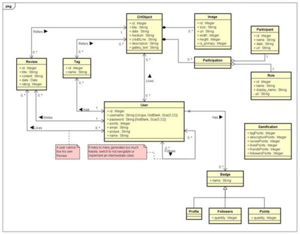
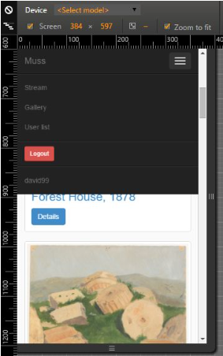
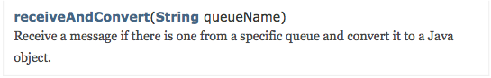

```
      ___           ___           ___           ___     
     /\__\         /\__\         /\  \         /\  \    
    /::|  |       /:/  /        /::\  \       /::\  \   
   /:|:|  |      /:/  /        /:/\ \  \     /:/\ \  \  
  /:/|:|__|__   /:/  /  ___   _\:\~\ \  \   _\:\~\ \  \ 
 /:/ |::::\__\ /:/__/  /\__\ /\ \:\ \ \__\ /\ \:\ \ \__\
 \/__/~~/:/  / \:\  \ /:/  / \:\ \:\ \/__/ \:\ \:\ \/__/
       /:/  /   \:\  /:/  /   \:\ \:\__\    \:\ \:\__\  
      /:/  /     \:\/:/  /     \:\/:/  /     \:\/:/  /  
     /:/  /       \::/  /       \::/  /       \::/  /   
     \/__/         \/__/         \/__/         \/__/    
```

- **Authors:** Raúl Cayetano Díaz, Álvaro González Reneses, David Macías Rodríguez and Adrián Puertas Cabedo
- **Module:** App. Development Frameworks 
- **Professor:** Larkin Cunningham 
- **Course:** Software Development 
- **Due date:** 18/12/15

## Introduction

In this document we will expose the different requirements, data models, problem/solution nd 
entries that were relevant to this 2 assignment. 

## Requirements

Since we were advised not to get into much detail for the requirements elicitation, we omitted the information requirements. They can be easily extracted from the function requirements below.

## Functional requirements.

Every user in the application must be able to:

- FR001: Have access to the metadata from GitHub; that is, to a databa concerning all the cultural heritage objects (CHOs), Participants or Roles in an appropiate way.

Every registered user must be able to:

- FR002: List the users and display the profile of a user of the application.
- FR003: Follow and unfollow a user.
- FR004: Create reviews for CHOs, allowing them setting a rating.

Use social media features, such as following:

- FR005: Follow other users and like/appreciate CHOs.
- FR006: Have an activity stream on a user's home / profile page.
- FR007: Post messages to Facebook and/or Twitter.
- FR008: A crowdsourcing feature, such as allowing users to add tags or descriptions to CHOs.
- FR009: A gamification feature to allow users to receive points and badges for their participation on the site.

Participation could include, but is certainly not restricted to:
* Tagging / describing CHOs (points per tag, badges at certain level of points)
* Providing additional commentary / reviews of CHOs (consider whether numbers of likes / thumbs ups recieved for comments should form the basis of whether or how
many points are awarded).
* Accumulating followers and / or friends (e.g. get a special badge for accumulating 10, 25, 50, 100, etc).

## Non-Functional Requirements

- NFR001: Retrieve the data to the database from the GitHub metadata.
- NFR002: Several Data models could potentially be used for this project. You can choose from relational (e.g. MySQL), key-value (e.g. Redis), document-oriented (e.g. MongoDB), or graph (e.g. Neo4j). Or you can go for a polygot approach and use more than one database.
- NFR003: It is likely there will be a substantial relational database access layer in your solution. While JdbcTemplate can be used (e.g. reused from assignment 1), a substantial amount of your data access code (i.e. repositories) could also use JPA. Remember to include JUnit classes as you code.
- NFR004: The application must use the layered architecture patterns discussed in the lectures. You will also use Spring MVC as an architectural pattern. This means you should have a Presentation – Controller – Service – Repository architecture.
- NFR005: For the core product, you will use Spring Web / MVC and either / or of JdbcTemplate and Spring Data JPA. You must, however, implement one feature of the site using one of the following technologies: SOAP, REST, RabbitMQ / AMQP, Spring Data Neo4j.
- NFR006: Security. A consistent web application system should let each type of user (logged, anonymous, with admin rights, ..) access to the resources that are allowed for them, this should be achieved using Spring security (WebSecurityConfig).
- NFR007: User Interface. The application must assure that the user finds it “easy-to-use” and appropriate given the context and his necessities. Furthermore, it should be reasonably responsive to the correct display in smaller devices.

## Data model
The data model has been developed to adjust it to the new requirements in the Muss page approach. The new features required the inclusion of entities such as Review, Tag, User, Badge and a datatype as Gamification to cope with all the logic behind this part. To model it has been needed aggregations, associations, inheritance, and all types of navigability.
Due to this new UML we were bound to add new attributes to the already used entities.



## Problem/solution entries and implementation challenges

* The access to static resources such as CSS files by default in the classpath by Spring (you just have to allocate the files in the /static folder) wouldn’t read those files and needed to add a custom WebConfig and let access to those directions through WebSecurityConfig.
* Persistance JPA problems, resolved by allocating the right set of annotations and data structures.

## Not requested but delivered features
* Use of Webjars (WebJars is simply taking the concept of a JAR and applying it to client­side libraries or resources. For example, the jQuery library may be packaged as a JAR and made available to your Spring MVC application. There are several benefits to using WebJars, including support for Java build tools such as Gradle and Maven.)
* Use of fragments to separate the different common parts of the display in a more efficient way.
* Implementation of API for the Gallery, with HMAC security.
* Inclusion of the front­end framework Bootstrap to help the fast development of a quick responsive user interface.
* Encoding of RabbitMQ notification messages
* Pagination for the appropriate display of a certain maximum number of Objects.
* Intuitive design badge structure and gamification
* Access to H2 console in the browser
* The implementation of the
gamification part was a nice excuse to apply the AOP principles seen on the lectures.



## Understanding RabbitMQ
RabbitMQ is an open source m essage broker software (sometimes called m essage­oriented
middleware) that implements the A dvanced Message Queuing Protocol (AMQP).

We will make use of this to implement a system of senders and receivers of updates. If an user is subscribed to other user and the last makes an update (lets say click on the like button or create a new review) the user would be sent a message through the RabbitMQ server that would be visible in the corresponding view.

When we want to notify the subscribers of a new interaction we proceed this way:

* First create a queue for each subscriber (using its unique id as binding key).
* Then, to retrieve the messages when a user wants to see the interactions with the
system of the users that he's been following we use the
`receiveAndConvert`.



* We continue iterating over this until the “ShutdownSignalException” marks the end of the communication.
* Finally we retrieve a collection of notifications, which we have envelope in a “MussNotification” class
* The MussNotifications would be displayed in the view depending of what instance of each subtype of notification is (e .g: ReviewNotification)

## Users

* All the users have the password: root
* There are currently four users: **reneses**, **adri**, **raul** and **david99**.
* Although it is possible to access to any of those, we recommend to create a new user in order to experience all the functionality.